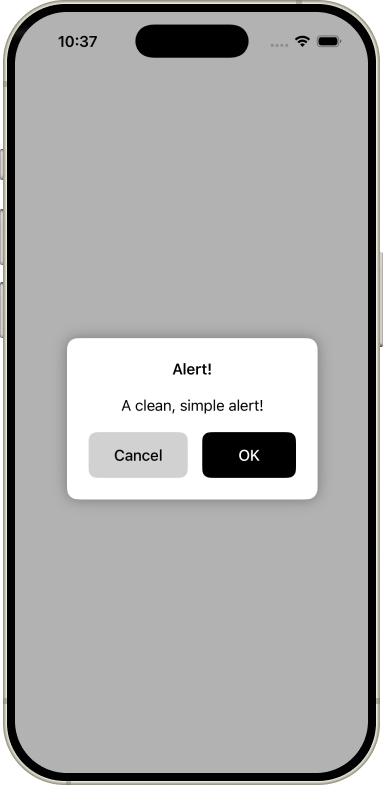

# AirAlert
AirAlert is a simple, clean view modifier that displays an alert with a few properties. It has no dependencies and is written entirely in SwiftUI. 



# Use Case
AirAlert can be used just like Apple's native alert modifier. However, AirAlert can give users a native feel to your app specifically. It's generally customizable and is best used when confirming/cancelling something in your app that isn't necessarily related to system/app settings.

# Usage
To present an alert in SwiftUI, use `.airAlert(isPresented:title:alertMessage:mainButtonLabel:secondButtonLabel:mainButtonAction:secondButtonAction)` modifier. 

For instance:
```
import SwiftUI
import AirAlert

struct NewAlert: View {
    @State private var isShown = false
    
    var body: some View {
        Button(action: {isShown.toggle()}) {
            Text("AirAlert!")
        }
        .airAlert(isPresented: $isShown,
                  title: "Alert!", alertMessage: "A clean, simple alert!",
                  mainButtonLabel: "OK",
                  secondButtonLabel: "Cancel",
                  mainButtonAction: {},
                  secondButtonAction: {})
    }
}
```
